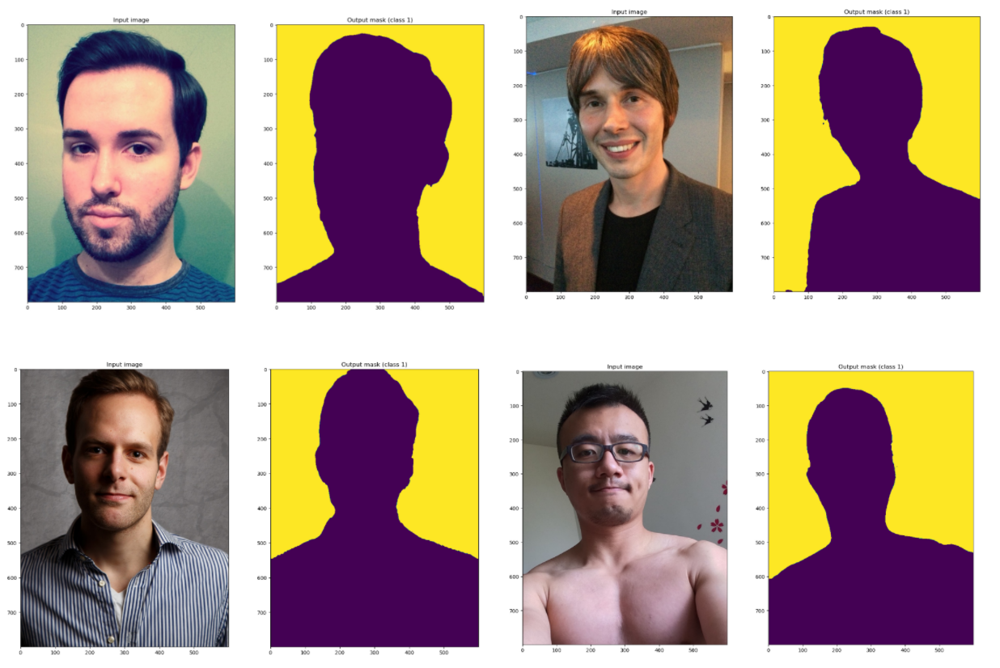

# Portrait Matting Demo with U-Net
customized U-net implemcentation with pytorch, trained for portrait matting. 



## Usage
**Note : Use Python 3.6 or newer**

Put Your train data in `./train/imgs` and `./train/masks`,Put your test data in `./test`
```
.
├── __pycache__
├── checkpoints
├── data
│   ├── imgs
│   └── masks
├── output
├── scripts
├── test
├── unet
│   └── __pycache__
└── utils
    └── __pycache__

```
### Training

```console
> python train.py -h
usage: train.py [-h] [--epochs E] [--batch-size B] [--learning-rate LR]
                [--load LOAD] [--scale SCALE] [--validation VAL] [--amp]

Train the UNet on images and target masks

optional arguments:
  -h, --help            show this help message and exit
  --epochs E, -e E      Number of epochs
  --batch-size B, -b B  Batch size
  --learning-rate LR, -l LR
                        Learning rate
  --load LOAD, -f LOAD  Load model from a .pth file
  --scale SCALE, -s SCALE
                        Downscaling factor of the images
  --validation VAL, -v VAL
                        Percent of the data that is used as validation (0-100)
```

By default, the `scale` is 0.5, so if you wish to obtain better results (but use more memory), set it to 1.


### Prediction

After training your model and saving it to `MODEL.pth`, you can easily test the output masks on your images via the CLI.

To predict a single image and save it:

`python predict.py -i image.jpg -o output.jpg`

To predict a multiple images and show them without saving them:

`python predict.py -i image1.jpg image2.jpg --viz --no-save`

```console
> python predict.py -h
usage: predict.py [-h] [--model FILE] --input INPUT [INPUT ...] 
                  [--output INPUT [INPUT ...]] [--viz] [--no-save]
                  [--mask-threshold MASK_THRESHOLD] [--scale SCALE]

Predict masks from input images

optional arguments:
  -h, --help            show this help message and exit
  --model FILE, -m FILE
                        Specify the file in which the model is stored
  --input INPUT [INPUT ...], -i INPUT [INPUT ...]
                        Filenames of input images
  --output INPUT [INPUT ...], -o INPUT [INPUT ...]
                        Filenames of output images
  --viz, -v             Visualize the images as they are processed
  --no-save, -n         Do not save the output masks
  --mask-threshold MASK_THRESHOLD, -t MASK_THRESHOLD
                        Minimum probability value to consider a mask pixel white
  --scale SCALE, -s SCALE
                        Scale factor for the input images
```
You can specify which model file to use with `--model MODEL.pth`.

## Data

数据集：2000张肖像照片。。百度网盘Link: http://pan.baidu.com/s/1dE14537 Password: ndg8 仅供学术交流，如有引用，请通知原作者shenxiaoyong。


---

**Thanks**

Original paper by Olaf Ronneberger, Philipp Fischer, Thomas Brox:

[U-Net: Convolutional Networks for Biomedical Image Segmentation](https://arxiv.org/abs/1505.04597)


